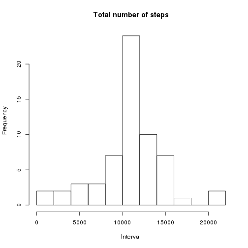
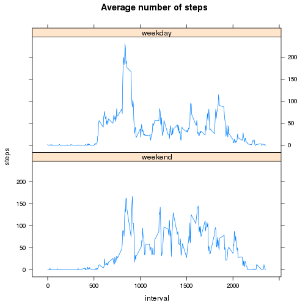

##Introduction

This report addresses a set of requirement included herein: the enumered section of this report corresponds to the "review criteria". All of the R code needed to reproduce the results (numbers, plots, etc.) are included in this report.

0. Load libraries

```r
#load all required libraries
library(lattice)
library(magrittr)
library(dplyr)
```

## Loading and preprocessing the data
**1. Code for reading in the dataset and/or processing the data**

```r
#read data (see activity.zip) from current directory
activity <- read.csv("activity.csv", header = TRUE, sep = ",", na.strings = "NA")
activity$date <- as.Date(activity$date, format = "%Y-%m-%d")
```


## What is mean total number of steps taken per day?
**2. Histogram of the total number of steps taken each day**

```r
#calculate total number of steps taken per day
TotalStepsPerDay1 <- activity %>% select(date, steps) %>% group_by(date) %>% summarise_each(funs(sum(., na.rm = TRUE)))

#generate the histogram
hist(TotalStepsPerDay1$steps, breaks = 10, xlab = "Interval", main = "Total number of steps")
```

 

**3. Mean and median number of steps taken each day**

```r
meanPerDay1 <- mean(TotalStepsPerDay1$steps, na.rm = TRUE)
medianPerDay1 <- median(TotalStepsPerDay1$steps, na.rm = TRUE)
```
* Mean: 9354.2295082
* Median: 10395

## What is the average daily activity pattern?
**4. Time series plot of the average number of steps taken**

```r
#calculate average number of steps by interval
AvgStepsByInterval <- activity %>% select(steps, interval) %>% group_by(interval) %>% summarise_each(funs(mean(., na.rm = TRUE)))

#generate the timeseries plot
with(AvgStepsByInterval, plot(x = interval, y = steps, type = "l", xlab = "Interval", main = "Average number of steps"))
```

 

**5. The 5-minute interval that, on average, contains the maximum number of steps**

```r
AvgStepsByInterval[AvgStepsByInterval$steps==max(AvgStepsByInterval$steps),]
```

```
## Source: local data frame [1 x 2]
## 
##   interval    steps
##      (int)    (dbl)
## 1      835 206.1698
```

## Imputing missing values
**6. Code to describe and show a strategy for inputting missing data**

```r
sum(is.na(activity$steps)==TRUE) #total number of missing values
```

```
## [1] 2304
```


```r
activity[is.na(activity)] <- 0 #simply replace missing values with 0
```

**7. Histogram of the total number of steps taken each day after missing values are inputted**

```r
#calculate total number of steps per day
TotalStepsPerDay2 <- activity %>% select(date, steps) %>% group_by(date) %>% summarise_each(funs(sum))

#generate the histogram
hist(TotalStepsPerDay2$steps, breaks = 10, xlab = "Interval", main = "Total number of steps") #plot histogram
```

 

In addition, subsequent to inputting the missing value we can compare the mean and median values (see review criteria 3); which are expectingly equal.


```r
meanPerDay2 <- mean(TotalStepsPerDay2$steps, na.rm = TRUE)
medianPerDay2 <- median(TotalStepsPerDay2$steps, na.rm = TRUE)
```
* Mean: 9354.2295082
* Median: 1.0395 &times; 10<sup>4</sup>


## Are there differences in activity patterns between weekdays and weekends?
**8. Panel plot comparing the average number of steps taken per 5-minute interval across weekdays and weekends**

```r
#transform data accordingly
weekend <- c("Saturday", "Sunday")
activity$w <- factor((weekdays(activity$date) %in% weekend), levels = c("TRUE", "FALSE"), labels=c("weekend", "weekday"))
activity1 <- activity %>% select(steps,interval,w) %>% group_by(interval, w) %>% summarise_each(funs(mean))

#generate the plot
xyplot(steps ~ interval | w, data = activity1, type = "l", layout=c(1,2), main = "Average number of steps")
```

 


